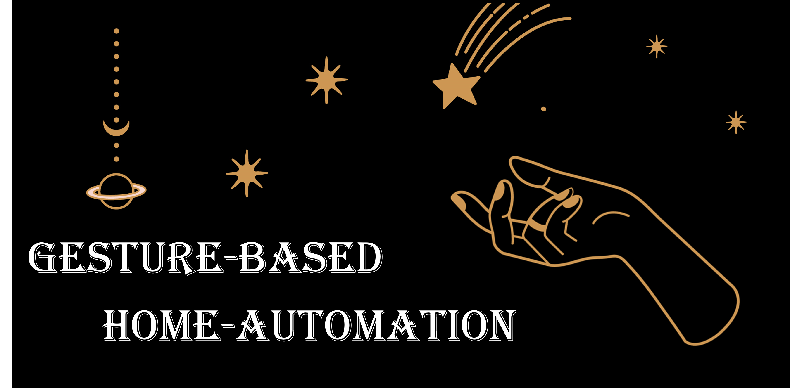
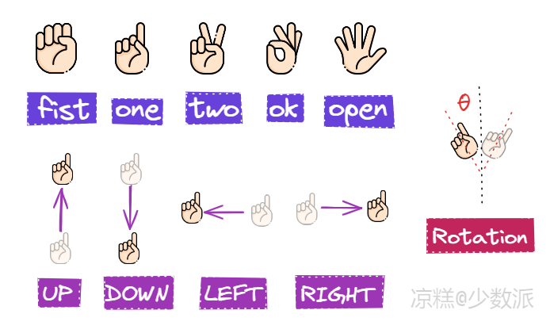

# UNDER CONSTRUCTION...



## Introduction 

Controll smart home devices through gesture.
- Multi person
- Low lantency
- Long distance



## Install

**Test on:**
- Ubuntu 22.04 on [Orange Pi](http://www.orangepi.org/html/hardWare/computerAndMicrocontrollers/service-and-support/Orange-Pi-5-Pro.html)
- Python 3.10.12
- RKNPU driver: v0.9.2
- librknnrt version: 2.0.0b0

```
pip install -r requirements.txt
```

## Run

**set frequency of cpu and npu**
```
sudo ./performance.sh
```

### demo
```
python demo.py
```

### app
**run**
```
python app.py
```

**quit**
```
Ctrl + C
```

**pause**
```shell
curl -X POST http://localhost:5000/update_status -H "Content-Type: application/json" -d "{\"hasperson\": false}"
```

**resume**
```shell
curl -X POST http://localhost:5000/update_status -H "Content-Type: application/json" -d "{\"hasperson\": true}"
```

## About Latency

- Human Detection: ~50ms
- Head & Hand Detection: ~20ms
- Hand Pose: ~30ms

## Credits

- [Pinto](https://github.com/PINTO0309)
- [geaxgx/depthai_hand_tracker](https://github.com/geaxgx/depthai_hand_tracker)
- [leafqycc/rknn-multi-threaded](https://github.com/leafqycc/rknn-multi-threaded)